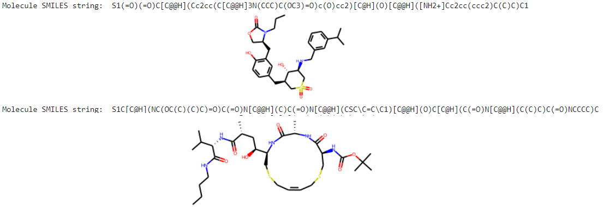

<h2>Graph Deep Learning to assess properties of Bio-Molecules from molecular structure</h2>

Molecular structure of <em><b>Bio-Molecules</b></em> possess valuable information about their properties such as <em>inhibition / binding capacity to specific receptors, solubility in water or other liquids</em> etc. The molecular structure can also be represented in the form of <em><b>Graph data-structures</b></em> for ease of storage & computation which also provides additional insights into how the various atoms in a molecule interact with each other. 
 
 
<b><a href="https://en.wikipedia.org/wiki/Simplified_molecular-input_line-entry_system">SMILES (simplified molecular-input line-entry system)</a></b> is used to describe structure of molecules in short strings. This project takes advantage of <em>SMILES</em> nomencalture of molecules to obtain graphical representations of respective molecular structure & estimate relevant molecular properties

  

<h3><em>Objective</em></h3>

This project explores Deep Learning techniques specifically <b>Graph Neural Networks</b> & associated algorithms to assess molecular properties from the <b><em>Graphical Representations</em></b> of molecules, which are derived from their respective <em>SMILES</em> representations.

The prediction tasks explored in this project are as follows:

- Estimate the binding capacity of inhibitors of <b>human β-secretase 1(BACE-1)</b> from the corresponding inhibitor molecular structure, as in - <a href="https://github.com/indropal/GraphDLBioMolecules/blob/main/BACE_GNN.ipynb">BACE_GNN.ipynb</a>.

- Estimate <b>Water Solubility</b> from molecular structure as explored in - <a href="https://github.com/indropal/GraphDLBioMolecules/blob/main/ESOL_GNN.ipynb">ESOL_GNN.ipynb</a>

- Predict the <b>Hydration Free Energy</b> from respective moleccular structure as performed in - <a href="https://github.com/indropal/GraphDLBioMolecules/blob/main/FreeSolv_GNN.ipynb">FreeSolv_GNN.ipynb</a>
